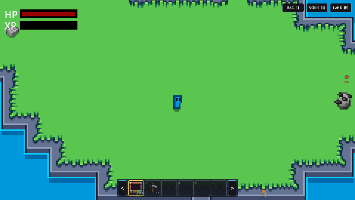
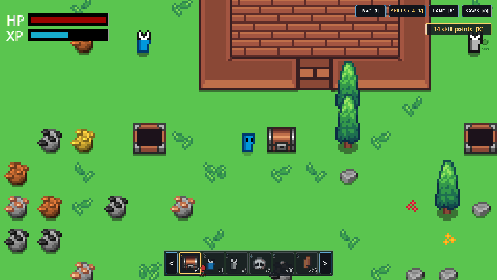
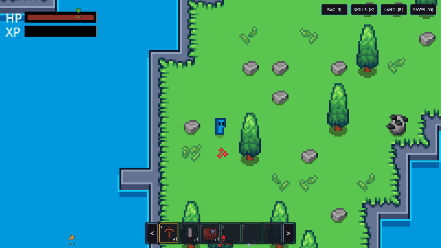
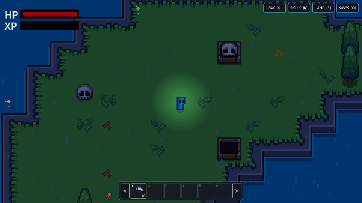
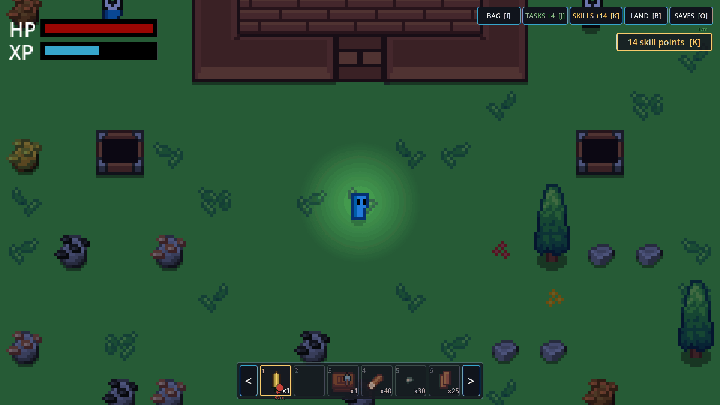
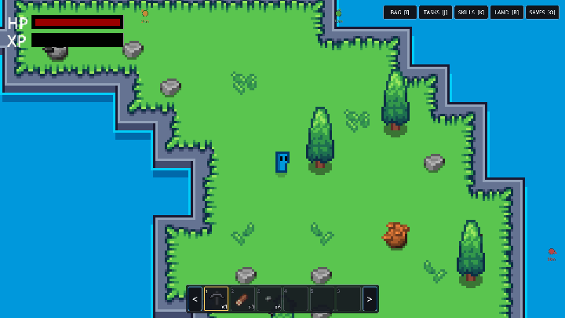
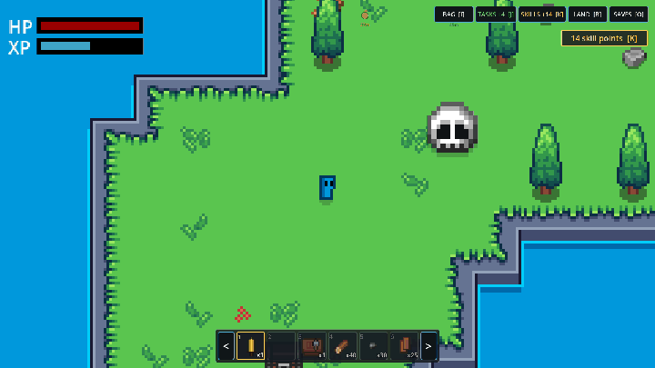

# Gather

Gather is a compact single-scene Godot 4.7 game focused on gathering, crafting, and survival.
It combines a simple item-driven gather loop with resource nodes, enemies, crafting stations, and a built-in self-test harness for reliable development.


### The turret loop

Place a bone turret, catch a skeleton in the net, drop the skull into the turret — then let
a bank of them hold the line. ([mp4](docs/media/turret-showcase.mp4))



### The worker loop

Lay out a chest and two worker bases, drop a captured skull into each, and the skeletons
fell a tree and break a rock while you watch — then open the chest and the haul is in it.
([mp4](docs/media/worker-showcase.mp4))



### Day, night and weather

A ten-minute day runs from afternoon to dusk, the lantern comes up, a storm rolls in off the
sea, and lightning walks in from the horizon before dawn breaks. The sea dims with the land —
they are separate canvases, so keeping them in step is deliberate.
([mp4](docs/media/weather-showcase.mp4))



### Charged skulls

Rarely, a bolt lands on a skeleton and what gets up is blue. Net it — killing one is a
loss — and its skull upgrades a machine: the charged turret on the right is clearing its
lane while the ordinary one beside it is still working through its own.
([mp4](docs/media/charged-showcase.mp4))



### Night raids

From the third night, the dark comes to you. A horn, a banner counting down, and a wave
that walks in out of the black at whatever you have built — which is the night the walls
and the turrets stop being decoration. Clear it before dawn and it pays.
([mp4](docs/media/raid-showcase.mp4))



### The quest board

Nothing else in the game asks you for anything. The board does: a handful of jobs with
live progress, so there is always something specific worth going and doing. Finish one and
hand it in for coins and xp.
([mp4](docs/media/quests-showcase.mp4))



### The run has an ending

Buying land far enough gets you to the boss island, and the elite standing on it is the
last fight in the game. Kill it and the run stops and totals itself up — days survived,
levels, land, raids cleared, everything the hours came to.
([mp4](docs/media/boss-showcase.mp4))



## Key Features

- Resource gathering with tool-based timing and bonus yields
- Crafting stations, recipes, and player progression
- Enemies, waves, and pickup/vacuum systems
- Save/load support using a `SaveLoad` group and JSON persistence
- Built-in Godot self-test harness for linting, unit tests, and runtime validation
- Beads issue tracking support via `.beads`

## Project Structure

All files and folders use snake_case; PascalCase is reserved for `class_name`
declarations and node names.

- `main.tscn` / `main.gd` — core scene, world generation, tile writes, and save format
- `player/` — player node, manager, and reach; `player/states/` holds the player state machine
- `enemies/` — enemy scenes and wave spawning; `enemies/states/` holds the enemy state machine
- `items/` — item and resource definitions, the shared `Types.Item` enum, pickups
- `inventory/` — inventory data, hotbar, and slot systems
- `crafting/` — crafting recipes, stations, and UI
- `turrets/` — turret and projectile logic
- `world/` — camera, resource gathering and spawning, plus `resource_nodes/`,
  `tile_scenes/`, and `vfx/`
- `systems/` — input, health, save/load, sound, level-up, and collision helpers
- `ui/` — HUD elements such as the gather progress bar and floating damage numbers
- `assets/` — `art/`, `audio/`, `tilesets/`, `materials/`, and `shaders/`
- `tools/` — lint and test runner scripts, plus `capture_clip.py` (records the README clips)
- `test/unit/` — headless unit tests
- `devtools_ext/` — project-specific DevTools commands
- `addons/godot_selftest/` — test harness implementation

## Requirements

- Godot Engine 4.7.x
- No external package manager required

## Setup

1. Open the project in Godot:
   ```bash
   "GODOT_PATH" --path . --mute
   ```
2. After adding or changing `class_name` scripts, run the import step:
   ```bash
   "GODOT_PATH" --headless --path . --import
   ```

## Run

Launch the game:
```bash
"GODOT_PATH" --path . --mute
```

## Linting and Testing

Run project linting:
```bash
"GODOT_PATH" --headless --path . --script res://tools/lint_project.gd
```

Run unit tests:
```bash
"GODOT_PATH" --headless --path . --script res://tools/run_tests.gd
```

## Development Workflow

- Use `bd` for issue tracking and work management
- Keep `project.godot` and `class_name` imports up to date
- Use `tools/devtools.py` and the DevTools bridge for automated runtime validation

## Web Deployment (itch.io)

The Web build is published to **https://severalherr.itch.io/gather**.

- **Trigger:** every push to `main` runs `.github/workflows/deploy-to-itchio.yml`.
  The workflow can also be started by hand from the Actions tab
  (`workflow_dispatch`).
- **What it does:** downloads Godot 4.7-stable and its export templates, imports
  the project (the `.godot/` cache is gitignored, so it must be rebuilt in CI),
  exports the `Web` preset to `bin/index.html`, and pushes `bin/` to itch.io with
  butler as `severalherr/gather:html5`.
- **Export preset:** `Web` (`preset.1` in `export_presets.cfg`). It is configured
  with `variant/thread_support=false` because itch.io serves pages without
  cross-origin isolation headers, so `SharedArrayBuffer` is unavailable.
- **`bin/` stays gitignored** — CI builds it fresh on every run.

### One-time setup

A repository secret named `BUTLER_API_KEY` must exist
(*Settings → Secrets and variables → Actions*). Generate the key at
https://itch.io/user/settings/api-keys. The itch.io project page must also exist
at `severalherr/gather`; the `html5` channel is created automatically by the
first successful butler push, and the uploaded build should be marked as
"This file will be played in the browser" on the itch.io project page.


