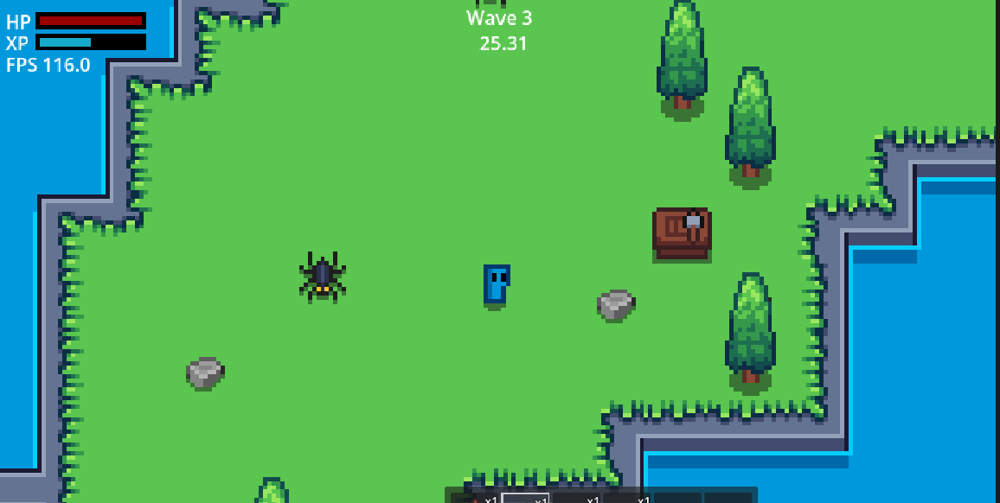

# Gather

Gather is a compact single-scene Godot 4.7 game focused on gathering, crafting, and survival.
It combines a simple item-driven gather loop with resource nodes, enemies, crafting stations, and a built-in self-test harness for reliable development.



## Key Features

- Resource gathering with tool-based timing and bonus yields
- Crafting stations, recipes, and player progression
- Enemies, waves, and pickup/vacuum systems
- Save/load support using a `SaveLoad` group and JSON persistence
- Built-in Godot self-test harness for linting, unit tests, and runtime validation
- Beads issue tracking support via `.beads`

## Project Structure

- `main.tscn` / `main.gd` — core scene and game loop
- `Items/` — item definitions, resources, pickups, and gather logic
- `Inventory/` — inventory, hotbar, and slot systems
- `Crafting/` — crafting recipes, stations, and UI
- `Enemies/` — enemy states, AI, and wave spawning
- `tools/` — lint and test runner scripts
- `devtools_ext/` — project-specific DevTools commands
- `addons/godot_selftest/` — test harness implementation

## Requirements

- Godot Engine 4.7.x
- No external package manager required

## Setup

1. Open the project in Godot:
   ```bash
   "GODOT_PATH" --path . --mute
   ```
2. After adding or changing `class_name` scripts, run the import step:
   ```bash
   "GODOT_PATH" --headless --path . --import
   ```

## Run

Launch the game:
```bash
"GODOT_PATH" --path . --mute
```

## Linting and Testing

Run project linting:
```bash
"GODOT_PATH" --headless --path . --script res://tools/lint_project.gd
```

Run unit tests:
```bash
"GODOT_PATH" --headless --path . --script res://tools/run_tests.gd
```

## Development Workflow

- Use `bd` for issue tracking and work management
- Keep `project.godot` and `class_name` imports up to date
- Use `tools/devtools.py` and the DevTools bridge for automated runtime validation


